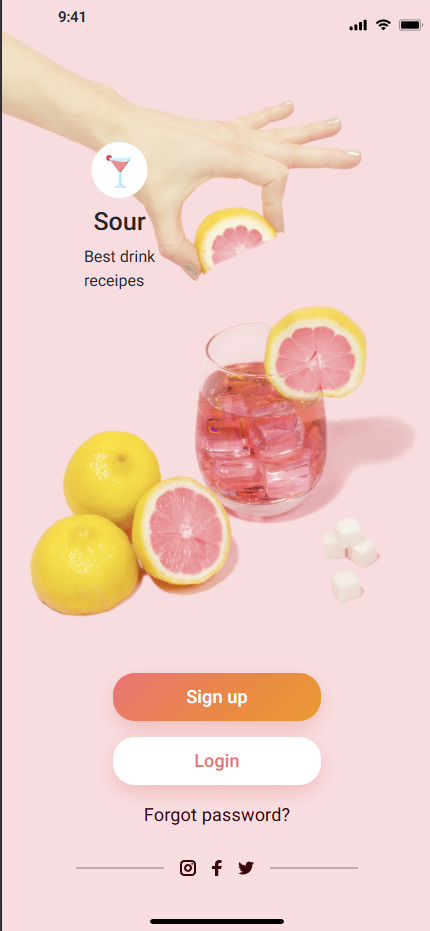
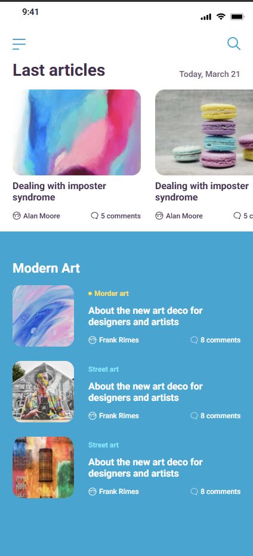
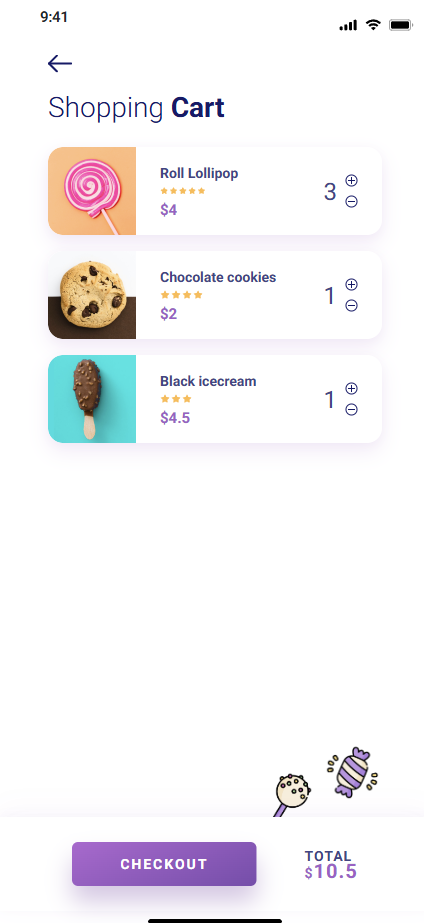
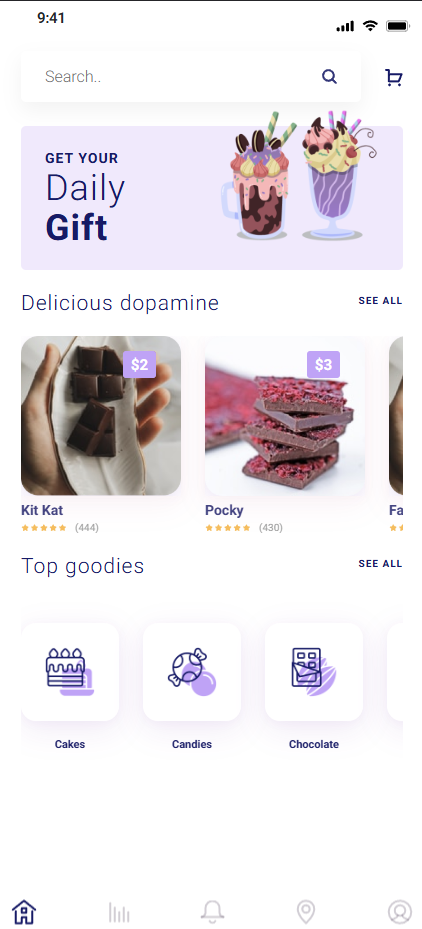
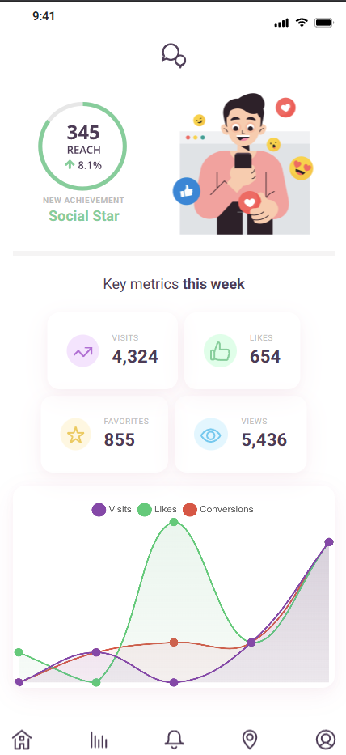
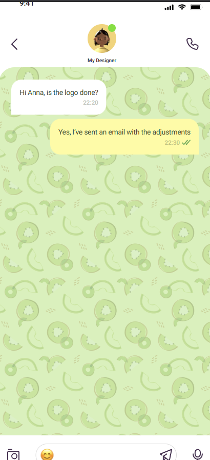
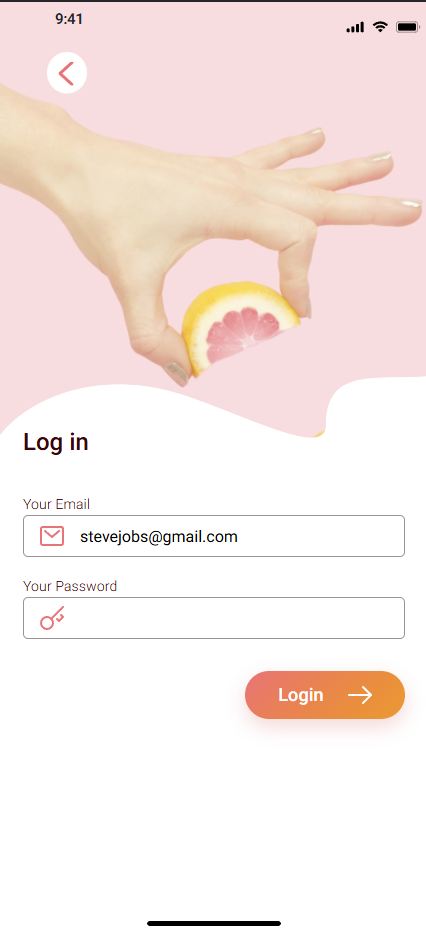
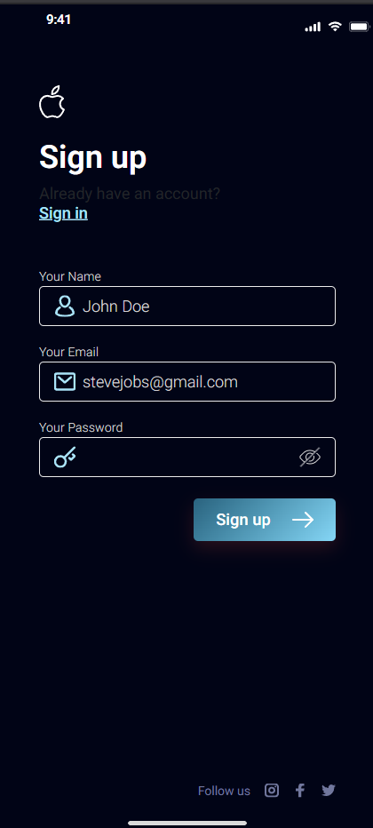
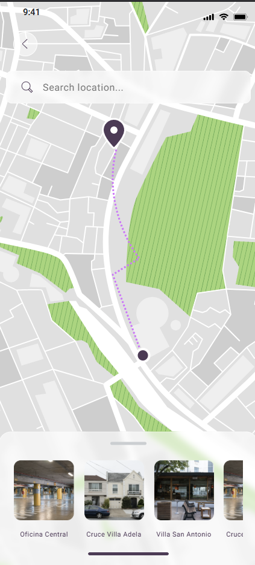

# 🌐 UI Design Project

A modern UI Design project built using **HTML**, **CSS**, **JavaScript**, and **Bootstrap**, featuring responsive pages for various web application needs like blogs, e-commerce, chat, dashboards, and more.

---

## 🚀 Features

- 🖥️ **Responsive Design** (Mobile, Tablet, Desktop)
- 🛒 **E-commerce Pages** (Cart, Product Display)
- 📝 **Blog Pages**
- 📊 **Dashboard Interface**
- 💬 **Live Chat UI**
- 🔐 **Login & Signup Forms**
- 📍 **Interactive Map View**
- 👤 **User Profile Page**
- 👋 **Welcome / Landing Page**
- 🎨 **Bootstrap 5** for Layout and Components

---

## 📁 File Structure
```
ui-design-project/
├── assets/
│ ├── css/
│ │ └── styles.css
│ ├── images/
│ │ └── (all image assets including screenshots)
│── blog.html
│── cart.html
│── chat.html
│── dashboard.html
│── ecommerce.html
│── login.html
│── signup.html
│── map.html
│── profile.html
│── welcome.html
├── index.html
├── script.js
└── README.md
```

---

## 🖼️ Screenshots

> All screenshots are located in `assets/images/`.

| Page | Preview |
|------|---------|
| 👋 Welcome |  |
| 📝 Blog |  |
| 🛒 Cart |  |
| 🛍️ Ecommerce |  |
| 📊 Dashboard |  |
| 💬 Chat |  |
| 🔐 Login |  |
| 🔐 Signup |  |
| 📍 Map |  |
| 👤 Profile |  |

---

## 🔧 How to Run the Project

1. Clone the repository:
   ```bash
   git clone https://github.com/shelavalepallavi/ui-design.git
   cd ui-design
   
Open index.html in your browser:

```
open index.html
```


🛠️ Technologies Used
HTML5

CSS3

JavaScript (ES6)

Bootstrap 5

